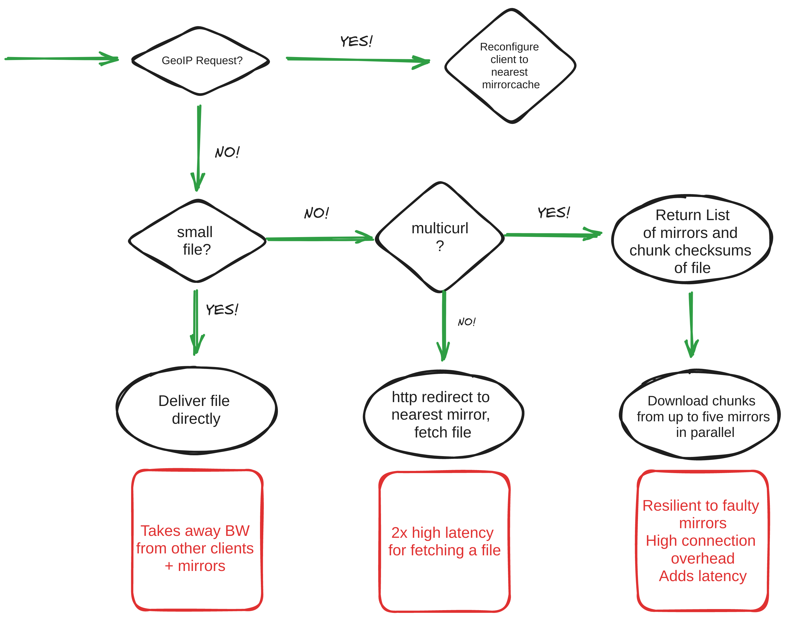

# Introduction

## Who are these guys?

* Bernhard M. Wiedemann
  * working for SUSE
  * involved with our download infra for some years
  * did also: reproducible builds, openQA, OpenStack, OBS

* Dirk Müller
  * working for SUSE
  * not involved in download infra so far

# Typical problems

## Number of users growing

## Maxed out Network Bandwidth

## spikes from full rebuilds (1-3 per year)

## spikes from Leap+Tumbleweed updates

## short spikes from a company's mass-updates

## How does updating work?

* Uses libzypp underneath
  * openSUSE Leap or older: Only Multi-Curl available
  * openSUSE Tumbleweed: Geo-IP redirection, Multi-Curl, Medianetwork available

## How does downloading work?

## Why is this so freaking complicated?

* Glad you asked!
* Geo-IP feature allows to reduce latency to download.o.org (DE) by reconfiguring your client for 24h to a more local copy (mirrorcache in US, BR, JP, AU)
* Fetching mirror information *per file* means we can still serve some files from partially updated / half broken mirrors
* Fetching mirror information *per file* also means 2x latency for every file
* Fetching using threads/multi-curls from mirrors means we can silently discard chunk fetch attempts from broken mirrors (serving corrupt data, or that are down) without affecting the user experience
* Fetching using threads also usually means lower overall performance
* => Lots of workarounds for unreliable mirrors!

## CDN in-front-of-download.o.org experiment

* How did we measure?

`podman run -it registry.opensuse.org/opensuse/tumbleweed:latest bash -c " zypper ref; time zypper -n in -d patterns-games-games"`

* Tumbleweed zypper, download only 92MB over 179 packages from various locations on the globe (~ 514kb average per package, good mix of small and large packages)

* For CDN, thanks to Fastly.com for sponsoring bandwidth for openSUSE project!

## How does this perform in Germany?

## How does this perform in Finland?

## How does this perform in US West Coast?

## How does this perform in US East Coast?

## How does this perform in Australia?

## What did we learn?

* turning off multicurl without CDN is not universally beneficial
* Using a CDN+turning multicurl backend of is *always faster* than default
* Using a CDN allows turning off a lot of extra infrastructure to maintain (client + server-side!)
* Medianetwork backend is mixed bag still
* Manually setting the best mirror is still 3 - 5.5 (!) times faster
  * => needs further improvements in zypper

## Why do we need to improve?

* high latency causes poor performance outside Europe
* bottleneck on disk+net IO on download/stage
* number of users is growing
* some SPOFs can cause annoying outages
* current MirrorCache output is not trivial to cache

## What we already did

* regional mirrorcache in US, BR, JP, AU
* stage3
* downloadcontent2, -us1, -br

## What we could do (1)

* patch libzypp to
* * not do one req per file, but per dir
* * cache `/media` file for some time
* * not use too small chunks

## What we could do (2)
* patch MirrorCache to
* * return cachable mirrorlist(lat+lon+stability)
* * let server decide if to send metalink/302/rpm
* * integrate downloadcontent fallback for main repos into origin

## What we could do (3)

* split stage.o.o off download.o.o ; with or without /repositories
* rethink /repositories repopush to reduce write-only data
* use CDN to handle load-spikes and small files

# Questions & Answers & Discussion
